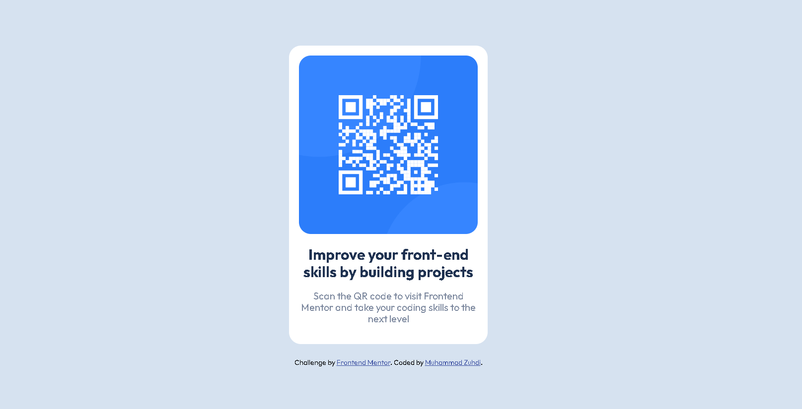

# Frontend Mentor - QR code component solution

This is a solution to the [QR code component challenge on Frontend Mentor](https://www.frontendmentor.io/challenges/qr-code-component-iux_sIO_H).

I wanted to test out my CSS skills and see my capabilities with vanilla CSS.

## Table of contents

- [Overview](#overview)
  - [Screenshot](#screenshot)
  - [Links](#links)
- [My process](#my-process)
  - [Built with](#built-with)
  - [What I learned](#what-i-learned)
  - [Useful resources](#useful-resources)
- [Author](#author)

## Overview

### Screenshot



### Links

- Solution URL: [https://www.frontendmentor.io/solutions/qr-code-component-html-and-css-94RmPaOaNE](https://www.frontendmentor.io/solutions/qr-code-component-html-and-css-94RmPaOaNE)
- Live Site URL: [https://mzuhdi.github.io/qr-code-component/](https://mzuhdi.github.io/qr-code-component/)

## My process

### Built with

- Semantic HTML5 markup
- CSS custom properties
- CSS Grid
- Mobile-first workflow

### What I learned

My biggest struggle during this challenge was figuring out the padding and margin. Initally I was using px but it didn't look that great. So I had to look for inspiration from others on how they did it and found that most were using rem for their margin and padding.

```css
.card {
  background-color: var(--White);
  display: flex;
  flex-flow: column;
  align-items: center;
  justify-content: center;
  border-radius: 1.2rem;
  margin: 0rem 2rem 0 2rem;
  padding: 1rem;
}
```

### Useful resources

- [Normalize CSS](https://necolas.github.io/normalize.css/) - Utilize Normalize.css to ensure that the elements are rendered consistently across different browser
- [Guide to Flexbox](https://css-tricks.com/snippets/css/a-guide-to-flexbox/) - CSS tricks article guide to flexbox is amazing resource to understand flexbos

## Author

- Frontend Mentor - [@mzuhdi](https://www.frontendmentor.io/profile//mzuhdi)
